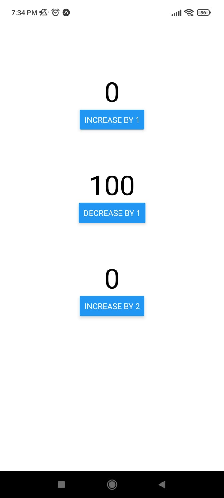
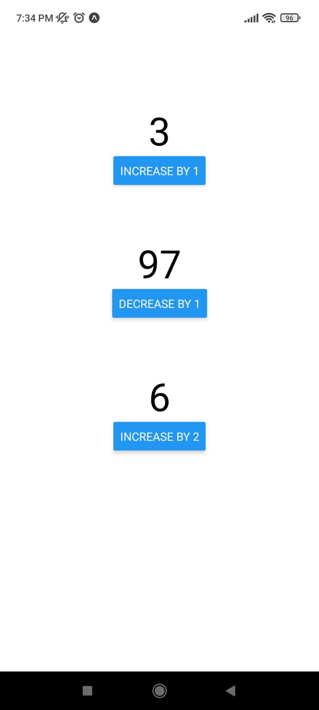

# Android-Club-Assignment-5
## Description:
A simple up and down counter example to demonstrate context api  
First counter increments by 1  
Second counter decrements by 1  
Third counter increments by 2
## ScreenShots :
### Initial:

### After taps:

